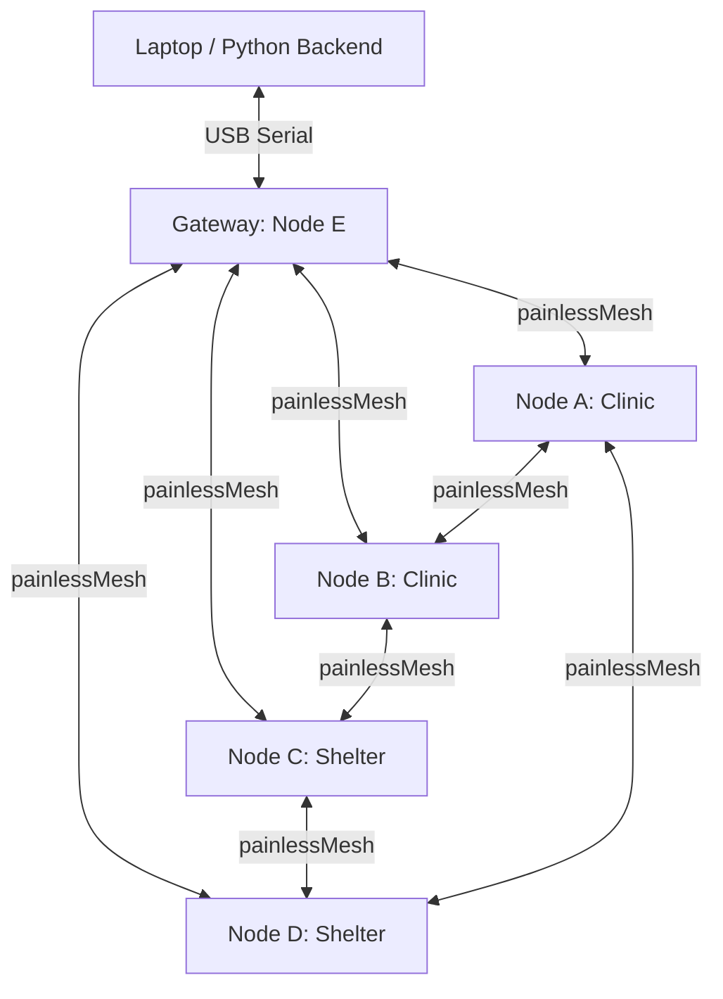

# System Architecture

This document describes the design and topology of the Adaptive Self-Healing Disaster Communication Mesh Network.



## Node Taxonomy and Roles

The network consists of 5 ESP32 nodes (designated 'A', 'B', 'C', 'D', and 'E').
* **Node E (Gateway)**: Connected to the Python backend via USB Serial. It acts as the bridge between the wireless ad-hoc mesh network and the central controller dashboard.
* **Nodes A, B, C, D (Peers)**: Client nodes located in the field (e.g., Local Clinics, Civilian Shelters). They monitor local conditions, broadcast sensor/logistics data, and route traffic.

## Design Philosophy

1. **Dumb Nodes, Smart Controller**: The ESP32 nodes do not run routing algorithms (like Dijkstra or A*) themselves. Instead, they maintain a local static lookup table for the next hop of each destination. The path calculations are outsourced to the Python backend.
2. **Hybrid Protocol**: The system uses `painlessMesh` for physical ad-hoc mesh formation, node synchronization, and local packet transmission, while overlaying a custom character-based routing layer ('A'-'E') for multi-hop packet forwarding.

## Dynamic Address Mapping

painlessMesh identifies nodes by their 32-bit hardware-derived Chip IDs (e.g., `3562391295`). However, the architecture and the user use characters ('A'-'E').
* Every node broadcasts a `HEARTBEAT` packet containing its designated character ID (`source`) and its 32-bit `chipId`.
* By listening to these heartbeats, all nodes maintain a local lookup table mapping character IDs ('A'-'E') to 32-bit painlessMesh IDs.
* When routing to a next hop character (e.g., 'B'), the node looks up the corresponding 32-bit ID and uses painlessMesh's unicast `sendSingle` function.

## Routing Mechanism

Each node maintains a `routingTable` array:
```cpp
char routingTable[5]; // Stores next-hop letter for destinations 'A' through 'E'
```
* **Routing Lookup**: When a packet is received, the node checks `nextHop`. If it matches its own ID:
  - If the node is the final `destination`, it processes it.
  - If the node is not the final `destination`, it looks up the `destination` in its routing table to find the next hop character, updates the packet's `nextHop` field, and forwards it to the 32-bit ID of that next hop.
* **Route Configuration**: The Python backend generates `SET_ROUTE` commands and injects them via the Gateway. These commands update the static `routingTable` arrays on target nodes.
